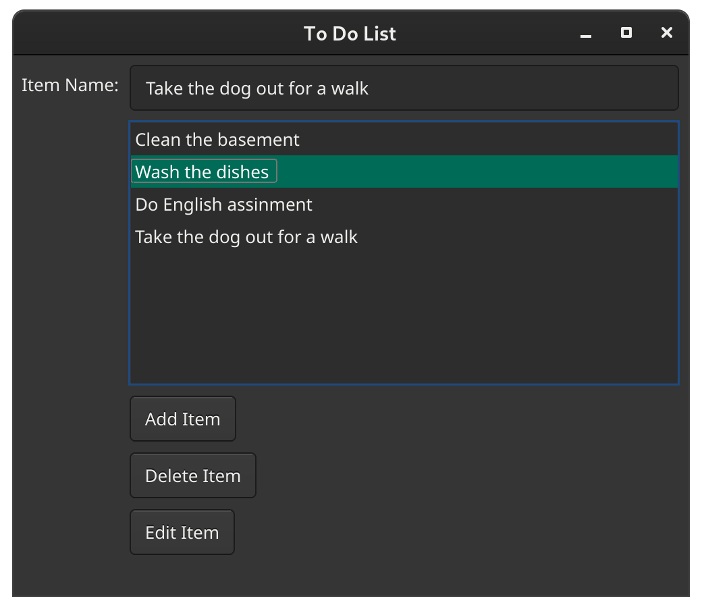

# To-do-list-GUI

A gui application that can store simple todo list that will theme to os to keep you organized. There are linux and Windows builds.

If you find any bugs or feature requests make a issue. or fix it and make a pull request.

